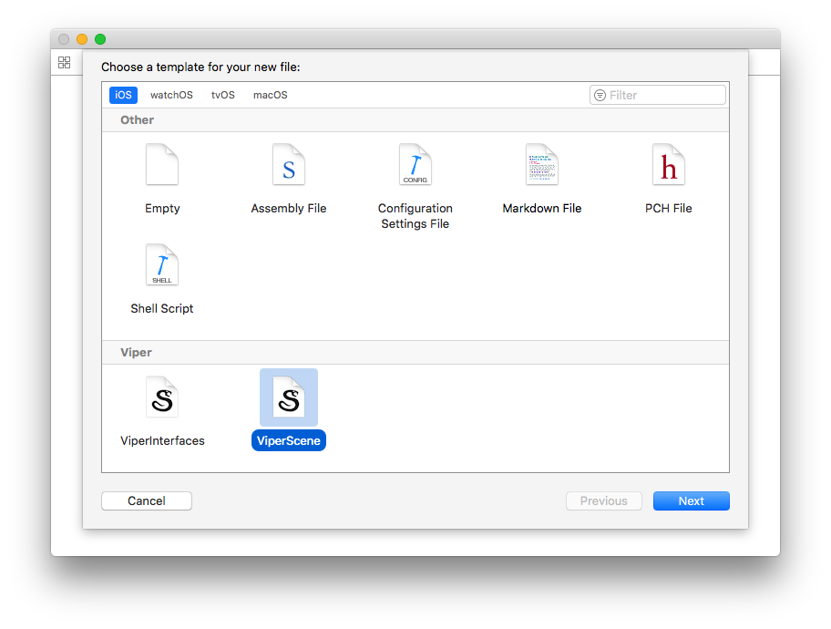

# XCodeScene

This project set XCode to create templates for VIPER.

## Instalation

1. Download project
2. Copy Template directory *~/Library/Developer/Xcode/Templates*

## Using

1. Open Xcode and open/create a Project.
2. Go to menu File > New > File...
3. Search for instaled template.

4. Be happy
